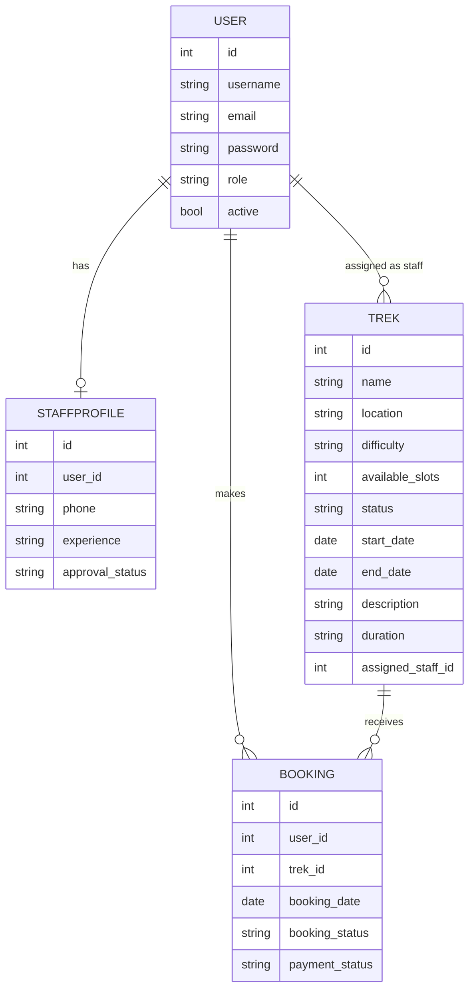

# Trekking Management Application

A role-based web application for managing trekking activities — built for the IITM BS Degree App Development project.

## About

Adventure organizations require efficient systems to manage trekking activities involving trek organizers, staff, and participants. Many trekking groups currently rely on spreadsheets, phone calls, or manual coordination, making it difficult to manage trek approvals, track bookings, avoid overbooking, and maintain trek history.

The **Trekking Management Application** solves this with a role-based system for **Admin**, **Staff**, and **Trekker** users — covering trek creation, staff assignment, participant management, bookings, and booking history, all in one place.

## Features

- Role-based registration and login for Admin, Staff, and Trekkers
- Admin dashboard for managing users, staff approvals, treks, and bookings
- Trek creation and staff assignment by Admin
- Staff trek management with trek status and available slot updates
- Participant management for staff members
- Trek browsing and details for Trekkers
- Trek booking system with booking confirmation and slot management
- Overbooking prevention based on available slots
- User booking history and booking status tracking
- Profile management for users and staff
- Role-based route protection using Flask sessions and custom authentication
- Password hashing for secure password storage

## Tech Stack

| Technology | Purpose |
|---|---|
| Flask | Core backend web framework (`app.py`) |
| Flask-SQLAlchemy | ORM for the SQLite database (`models.py`) |
| Jinja2 | Template engine for dynamic HTML pages (21 templates) |
| Bootstrap 5 | Frontend styling and responsive design (`base.html`) |
| HTML5 / CSS3 | Web structure and custom page layouts |
| Flask-Login | User authentication and session management |
| Werkzeug | Secure password hashing and verification |
| SQLite | Lightweight local database |

## Project Structure

```
├── app.py              # Main Flask application entry point + Blueprints
├── models/              # SQLAlchemy database models
├── templates/            # Jinja2 HTML templates
├── static/              # CSS and static assets
```

## Database Schema

**Tables**

- **User** — user account and profile details (id, username, email, password, role, active status)
- **StaffProfile** — staff-specific details (id, user_id, phone, experience, approval status)
- **Trek** — trek information (id, name, location, difficulty, available slots, status, start date, end date, description, duration, assigned staff)
- **Booking** — booking details (id, user_id, trek_id, booking date, booking status, payment status)

**Relationships**

- One-to-One: `User → StaffProfile`
- One-to-Many: `User → Trek` (as assigned staff)
- One-to-Many: `User → Booking`
- One-to-Many: `Trek → Booking`

**ER Diagram**



## User Roles

- **Admin** — creates and assigns treks to staff, manages users, staff approvals, treks, and bookings
- **Staff** — manages assigned treks, updates trek statuses, views participants
- **Trekker** — browses available treks, views details, makes bookings, tracks booking history

## Setup

```bash
# Clone the repository
git clone <repo-url>
cd trekking-management-application

# Create and activate a virtual environment
python -m venv venv
source venv/bin/activate   # On Windows: venv\Scripts\activate

# Install dependencies
pip install -r requirements.txt

# Run the application
python app.py
```

## API

Not applicable — this project does not expose a REST API.

## Author

**Arslan Ansari**
IITM BS Degree Program (Diploma Level)
25f2001880@ds.study.iitm.ac.in

## AI/LLM Usage Disclosure

ChatGPT (GPT-5) was used to assist with some CSS code, a few route definitions, and code/variable-naming optimization — roughly 10–15% of the overall work, limited to code suggestions and documentation formatting. All final implementation logic, debugging, and integration were done manually.